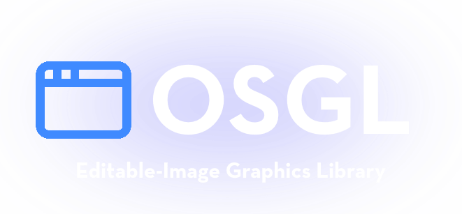

  

OSGL is a user-friendly and highly efficient module that allows you to draw pixels directly to the screen in Roblox.

## Features

- Easy to Learn: Designed with simplicity in mind, making it accessible for beginners and experienced developers alike.
- High Performance: Optimized for fast rendering

## Installation

To get started with OSGL, download the latest official release from the releases tab.

## Documentation

For comprehensive guides and resources to help you master OSGL, check out our official documentation [here](https://gunshot-sound-studios.github.io/osgl-graphics/)!
There, you’ll find tutorials, examples, and API references to assist you in making the most of this library.

## Contributing

OSGL is an open-source project that thrives on community contributions! Whether you want to report bugs, suggest features, or improve existing documentation, your involvement is welcome and appreciated.

### How to Contribute:

1. Fork the repository.
2. Create a new branch for your feature or fix.
3. Submit a pull request with a clear description of your changes.

## Authors

OSGL is developed and maintained by an amazing team of contributors:

- SawWasTaken
- jukepilot
- opensrcerror
- msix29
