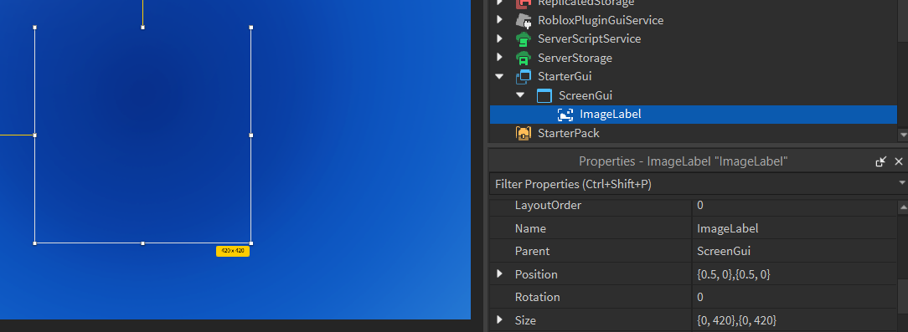

# Opening a Window

## Creating a canvas

In OSGL, a `Window` is an `EditableImage`. OSGL is wrapper around this `EditableImage` that gives you an easy-to-use higher-level API that can still interact with the base `EditableImage`.

A `Window` needs to be able to render its content on some sort of Image, so create an `ImageLabel` within a `ScreenGui` in `StarterGui`, with its `BackgroundTransparency` set to 0. Ensure that the `ScreenGui` is named `ScreenGui` and the `ImageLabel` is named `ImageLabel`. This `ImageLabel` will act as your primary canvas for rendering graphics. Your `StarterGui` hierarchy should look like this:
```
> StarterGui
    > ScreenGui
        > ImageLabel
```

To get a better view of the `ImageLabel` while in-game, you can place it in the center of the screen. This will help you see the rendered graphics more clearly instead of it being in a corner of the screen. Additionally, resizing the `ImageLabel` to a larger size, such as 420x420, can help you see what's rendered more easily.


*In this image, the `AnchorPoint` property is set to `.5, .5`, with the position being `.5, 0, .5, 0`, and the size being `0, 420, 0, 420`.*

:::note

Lower resolutions cause blurred images! If you're rendering at a low resolution, or just want a pixelated look, set the `ResampleMode` property of your `ImageLabel` to `Pixelated`!

:::

## Creating a Window

Now that we have a canvas to work with, we can start programming. Create a `LocalScript` in a suitable location, such as `StarterPlayer/StarterPlayerScripts`.

The main OSGL module is divided into several sub-modules, each serving a different purpose. To create a `Window`, we need the `Window` sub-module. Let's import it:

```lua
local ReplicatedStorage = game:GetService("ReplicatedStorage")

local OSGL = require(ReplicatedStorage.Packages.OSGL)
local Window = OSGL.Window
```

The `Window` module offers multiple ways to create a `Window`. The following is an extract from the API:

- `Window.from`: Creates an OSGL window from an existing `EditableImage`.
- `Window.new`: Creates an OSGL window by initializing a new `EditableImage` instance at the specified location.
- `Window.fromAssetId`: Creates a window given an assetId.
- `Window.fromBuffer`: Creates a window given a buffer.

Among the available options, `Window.new` is the most suitable for our needs. Since we do not have an existing `EditableImage`, this method will create one at the specified location. The function requires an `Image`, with an optional `WindowConfiguration` object:
```lua
local ReplicatedStorage = game:GetService("ReplicatedStorage")
local Players = game:GetService("Players")

local OSGL = require(ReplicatedStorage.Packages.OSGL)
local Window = OSGL.Window

local player = Players.LocalPlayer
assert(player)

local screenGui = player.PlayerGui:WaitForChild("ScreenGui")
local imageLabel = screenGui.ImageLabel

-- Create a Window with a size of 420x420. The size can be customized as needed,
-- but it does not have to match the size of the ImageLabel. Note that Windows
-- cannot exceed the maximum size of 1024x1024.
local window = Window.new(imageLabel, { sizeX = 420, sizeY = 420 })
```

It's a good idea to use constants instead of hardcoded width and height numbers because we could be referring to these values a couple of times in the future:

```lua
local WIDTH = 420
local HEIGHT = 420

local window = Window.new(imageLabel, { sizeX = WIDTH, sizeY = HEIGHT })
```

Your full code should now look something like this:

```lua
local ReplicatedStorage = game:GetService("ReplicatedStorage")
local Players = game:GetService("Players")

local OSGL = require(ReplicatedStorage.OSGL)
local Window = OSGL.Window

local player = Players.LocalPlayer
assert(player)

-- Dimensions
local WIDTH = 420
local HEIGHT = 420

local screenGui = player.PlayerGui:WaitForChild("ScreenGui")
local imageLabel = screenGui.ImageLabel

-- Create the window
local window = Window.new(imageLabel, { sizeX = WIDTH, sizeY = HEIGHT })
```

By default, OSGL renders all windows at 60 FPS. You can change this value using the `targetFPS` property:

```lua
local window = Window.new(imageLabel, { sizeX = WIDTH, sizeY = HEIGHT })
window.targetFPS = 244
```

## Drawing to a Window

To draw to the `Window`, use the `Draw` method, which returns a `DrawingContext`. To get the original `Window` object back, use `StopDrawing`:

```lua
-- Example.luau

-- Object refers to `window`
local object = window
                    :Draw() -- Open a `DrawingContext`
                    :SomeDrawingMethod() -- same as `draw.someDrawingMethod`
                    :AnotherDrawingMethod() -- same as `draw.anotherDrawingMethod`
                    :StopDrawing() -- Return the window
```

All methods in the `Window` module support method chaining. To fill the `Window` with a specific color, use the `Clear` method. OSGL uses its own custom color implementation. Import the `color` sub-module:

```lua
-- ...

local OSGL = require(ReplicatedStorage.OSGL)
local Window = OSGL.Window
local color = OSGL.color

-- ...

window:Clear(color.BLACK) -- Fills the window with a black RGBA color
```

To see the changes on the `Window`, you need to use the `Render` method. This method applies all the drawing operations to the screen:

```lua
-- ...

local OSGL = require(ReplicatedStorage.OSGL)
local Window = OSGL.Window
local color = OSGL.color

-- ...

window
    :Clear(color.BLACK) -- Fills the window with a black RGBA color
    :Render() -- Applies the changes to the screen
```

By calling `Render`, you ensure that all the drawing operations are displayed on the `Window`.

The full code should now look like:

```lua
local ReplicatedStorage = game:GetService("ReplicatedStorage")
local Players = game:GetService("Players")

local OSGL = require(ReplicatedStorage.OSGL)
local Window = OSGL.Window
local color = OSGL.color

local player = Players.LocalPlayer
assert(player)

-- Dimensions
local WIDTH = 420
local HEIGHT = 420

local screenGui = player.PlayerGui:WaitForChild("ScreenGui")
local imageLabel = screenGui.ImageLabel

-- Create the window
local window = Window.new(imageLabel, { sizeX = WIDTH, sizeY = HEIGHT })
window.targetFPS = 244

window
    :Clear(color.BLACK)
    :Render()
```
Running this code should color the entire `Window` black:


And that's it! You've successfully rendered to a `Window` in OSGL.