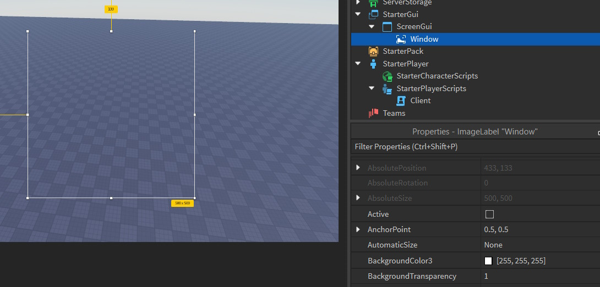

# Setting up your environment

Before we can *use* OSGL, there are a few things we need to do first. Firstly, we need to make sure that we have the EditableImage beta enabled in Studio. You can enable it in `File > Beta Features > EditableImages & EditableMeshes`

If you haven't already, grab yourself the latest copy of OSGL from the [github](https://github.com/Gunshot-Sound-Studios/osgl-graphics/releases/latest) or the [Roblox Marketplace](https://create.roblox.com/store/asset/18468099737/OSGL), and insert it into Studio in a suitible place (such as `ReplicatedStorage/Packages`)

Create an `ImageLabel` in `StarterGui`, with its `BackgroundTransparency` set to 0. This `ImageLabel` will serve as your canvas:

:::note

Lower resolutions cause blurred images! If you're rendering at a low resolution, or just want a pixelated look, set the `ResampleMode` property of your `ImageLabel` to `Pixelated`!

:::

Additionally, create a `LocalScript` in your desired location (e.g., `StarterPlayer/StarterPlayerScripts` ). This script will create our window and manage the rendering process.

Now we can start programming!
